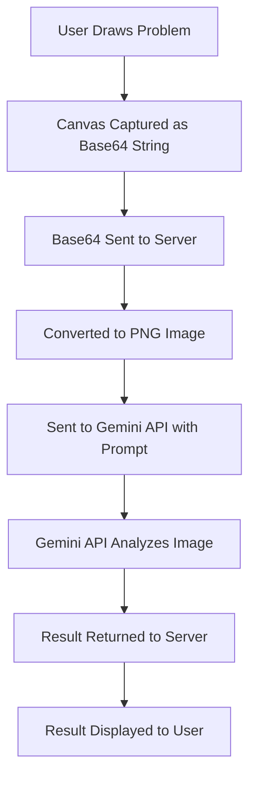

# AI Drawing Calculator Project Report

## Introduction

The **AI Drawing Calculator** is a mobile application that leverages advanced AI and graphical interpretation to solve mathematical and physics problems drawn by the user. The app's intuitive interface allows users to draw equations or scenarios, which are then analyzed and solved using cutting-edge technology. The solution or result is presented back to the user in a clear and concise manner.

## Objective

To provide a platform where users can visually represent and solve complex mathematical and physics problems using AI and graphical interpretation.

## Key Features

- **Mathematical Problem Solving:** Users can draw simple or complex equations to receive solutions.
- **Physics Problem Analysis:** The app can interpret and solve physics-related problems based on user drawings.
- **Abstract Concept Recognition:** The app can identify and interpret abstract concepts from user drawings.
- **High-Performance Rendering:** Achieves 60 FPS drawing rendering using React-Native-Skia for a seamless experience.

## Working Methodology

### 1. User Input
- Users draw a problem (mathematical, physics, or abstract) on the canvas.
- Upon completion, the user clicks the "Equation" button to process the drawing.

### 2. Canvas Capture
- The canvas is captured as a base64 string for processing.

### 3. Server Processing
- The base64 string is sent to the backend server built using FastAPI.
- The server converts the base64 string into a PNG image.

### 4. AI Integration
- The server sends the PNG image to the Gemini API along with a custom prompt.
- The Gemini API analyzes the image and solves the problem according to predefined rules (e.g., PEMDAS).

### 5. Result Delivery
- The Gemini API returns the solution or result.
- The app receives the server response and displays the result to the user.

## Technology Stack

### Frontend
- **Framework:** Expo (React Native).
- **Language:** TypeScript for type safety and improved development efficiency.
- **Styling:** Tailwind CSS with NativeWind for fast and responsive UI development.
- **Graphics Engine:** React-Native-Skia for rendering drawings and capturing snapshots at high performance.

### Backend
- **Framework:** FastAPI for efficient handling of base64 image conversion and communication with the Gemini API.

### AI Model
- **Gemini API:** Utilized for analyzing and solving problems from the user-provided drawings.

## Custom Prompt

The custom prompt is meticulously designed to guide the Gemini API in interpreting the input images and solving the problems. The prompt adheres to the **PEMDAS rule** for mathematical operations and provides detailed guidelines for handling different types of problems, including:

1. **Simple Mathematical Expressions**
2. **Set of Equations**
3. **Variable Assignments**
4. **Graphical Math Problems**
5. **Abstract Concepts**

## Project Workflow Diagram

## Advantages

1. **User-Friendly Interface:** The app's drawing interface provides an intuitive way for users to input problems.
2. **AI-Powered Solutions:** Advanced problem-solving capabilities using the Gemini API.
3. **Versatility:** Handles a wide range of problems, from simple equations to abstract concepts.
4. **High Performance:** Optimized rendering and processing ensure smooth user experience.

## Conclusion

The **AI Drawing Calculator** combines state-of-the-art technologies in AI, graphical rendering, and mobile development to provide a unique problem-solving tool. Its ability to interpret and solve both mathematical and physics problems, along with abstract concepts, makes it an innovative and versatile application.

## Future Enhancements

- Add support for more complex physics scenarios.
- Improve the accuracy of abstract concept recognition.
- Integrate offline problem-solving capabilities using on-device AI models.
- Enhance the UI/UX for an even more seamless experience.

---